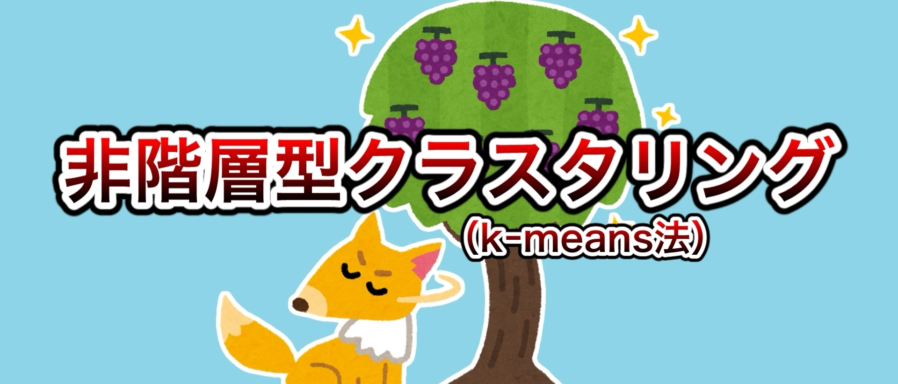
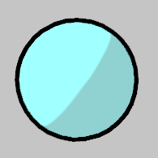
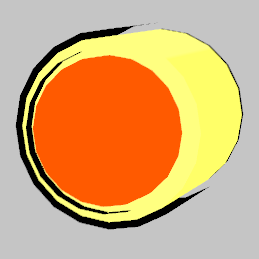
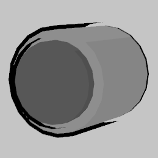
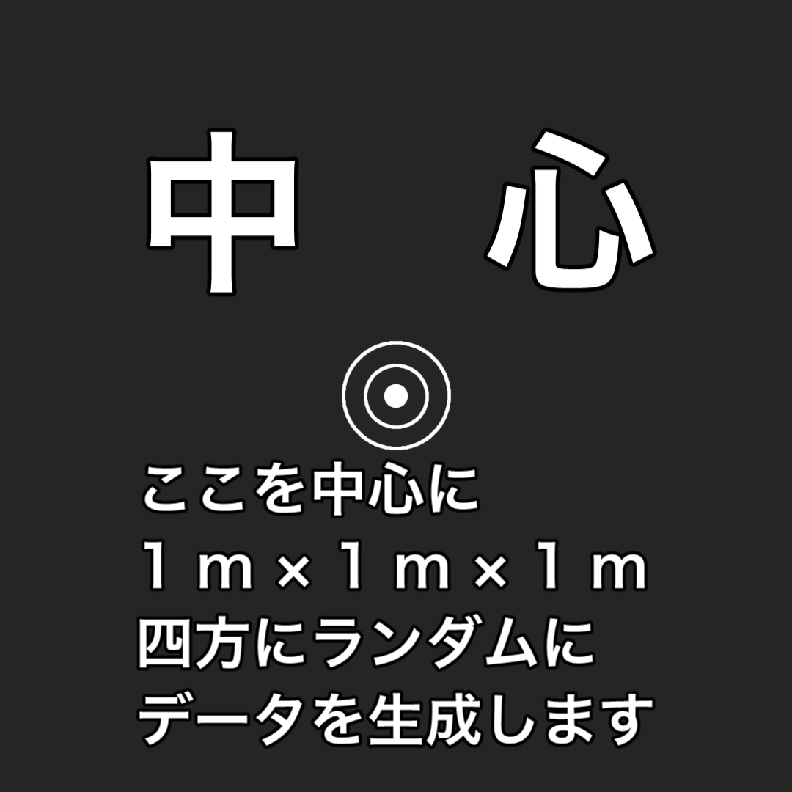
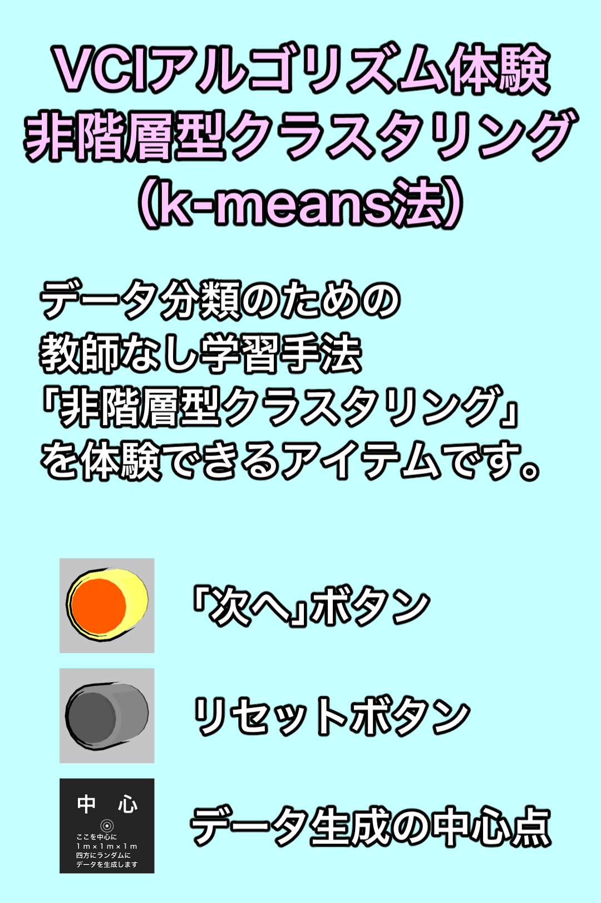

日本人の方は[日本語版](./README.md)をお読みください。

# VR Algorithmic Experience “Non-Hierarchical Clustering” (k-means method)

This is a VR item which can experience machine learning algorithms. You can experience “non-hierarchical clustering” (k-means method), an unsupervised classification method.

## How to Use

- The light blue ball is a data (it can be moved).  
	
- The orange button in the yellow tube is the “Next” button.  
	
- The button in the grey tube is the “Reset” button.  
	
- The board marked “中心” is the “Centre Object”.  
	
- The light blue board is the “Information Board”.  
	

1. Place the “Centre Object” at the position where you want to generate data.
1. When you press (grip) the “Next” button, data will be generated. The data can be moved.
1. Then, the item can proceed with the calculation one step at a time by your pressing the “Next” button. What it has done in that step will be shown on the “Information Board”.
1. When the calculation has been completed and the best grouping has been reached, the information board will display the message “収束しました” (means converged).
	- The number of data is 20, so it takes approximately 3 loops to converge (but it depends on the situation).
	- It is also possible to move data in the middle (or after convergence), although this is not possible during actual data analysis.

## Introduction Video

- **(Video)** I Made an VR Item to Experience Machine Learning 【超作フェス (Cho Making Festival) 2021 Simultaneous Posting】
	- YouTube：[https://youtu.be/wd9FsdMggvY](https://youtu.be/wd9FsdMggvY)
	- niconico：[sm38649641](https://www.nicovideo.jp/watch/sm38649641)
- **(Video)** Explanation of AI and Cluster Analysis Using Self-made Item 【VR Academia 3rd Anniversary Countdown】
	- YouTube：[https://youtu.be/UO62wXaPRpg](https://youtu.be/UO62wXaPRpg)
	- niconico：[sm38768895](https://www.nicovideo.jp/watch/sm38768895)

※ Machine translated subtitles are available on YouTube.

- **(Event)** This will be on display at “夏キャスマーケット2021” (Summer VirtualCast Market 2021).
	- Press on the image below to go to “キャスマーケット” (VirtualCast Market) website.
	- 

## Distribution

THE SEED ONLINE：[https://seedonline.jp/products/ceb94d63b67213db6ecc8e4d04daaeb4fd27ab2dfe10754a36819044811f1a4b](https://seedonline.jp/products/ceb94d63b67213db6ecc8e4d04daaeb4fd27ab2dfe10754a36819044811f1a4b)

## You Want to Modify on Unity?

Clone this repository and open it in Unity.

- Unity version at developing：2019.4.25f1
- Assets you need
	- [UniVCI](https://github.com/virtual-cast/VCI)
- Others
	- Sound effect files are not included in the repository, so please prepare your own.

## Change Log

YYYY/MM/DD（Year/Month/Date）

- 2021/07/27　Ver 2.0.2　Add the “Information Board”.
- 2021/07/26　Ver 2.0.1　Change of coordinate space & Change method of convergence detection.
- 2021/07/25　Ver 2.0.0　Improved synchronization ＆ Fixed to place data around a centre object ＆ Added button sound ＆ Convergence detection.
- 2021/05/16　Ver 1.1.0　To show averages ＆ Calculate per step.
- 2021/04/28　Ver 1.0.0　Things that will work for the time being for “超作フェス”.
