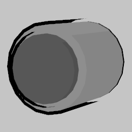
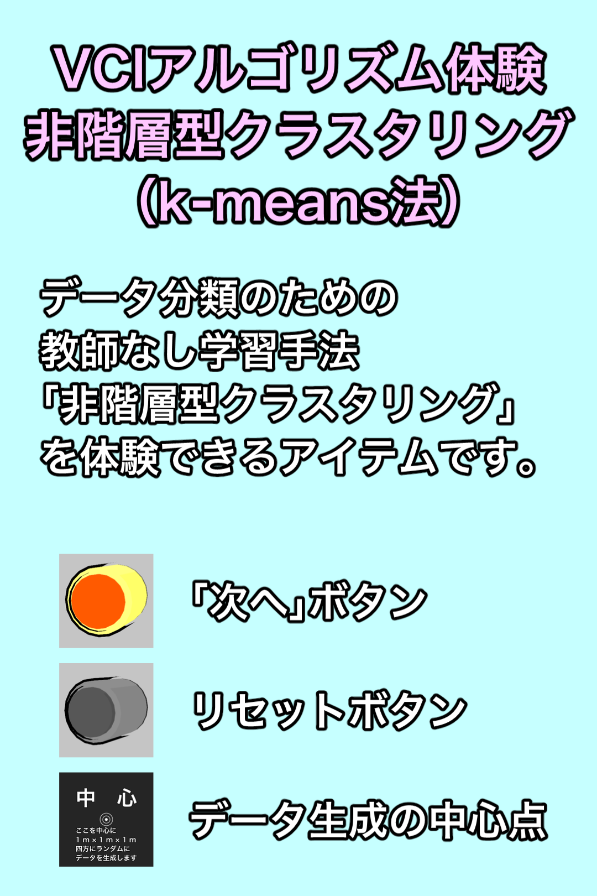

If you speak English, please read [English version](./README-en.md)

# VRアルゴリズム体験「非階層型クラスタリング」（k-means法）

VRで機械学習のアルゴリズムを体験できるヤツの第1弾です。教師なしの分類（グループ分け）手法である「非階層型クラスタリング」（k-means法）を体験できます。

## 使い方

- 水色の玉がデータ（移動可能です）。  
	
- 黄色い筒に入ったオレンジのボタンが「次へ」ボタンです。  
	
- 灰色の筒に入ったボタンが「リセット」ボタンです。  
	
- 中心と書かれた板が「中心オブジェクト」です。  
	
- 水色の板が「案内板」です。  
	

1. データを生成したい位置に「中心オブジェクト」を置きます。
1. 「次へ」ボタンを押すと（グリップすると）、データが生成されます。データは自由に動かせます。
1. その後、「次へ」ボタンを押すことで1ステップずつ計算が進みます。そのステップで何をしたかは「案内板」に表示されます。
1. 計算が終了し、最適なグループ分けになると、案内板に「収束しました」と表示されます。
	- データ数は20個なので、だいたい3ループくらいで収束します（ただし、その時によります）。
	- 実際のデータ分析の際にはあり得ませんが、途中でも（あるいは収束後に）データを動かすこともできます。

## 紹介

- **（動画）** VRで機械学習を体験できるヤツを超作ってみた 【超作フェス2021一斉投稿】
	- ニコニコ動画：[sm38649641](https://www.nicovideo.jp/watch/sm38649641)
	- YouTube：[https://youtu.be/wd9FsdMggvY](https://youtu.be/wd9FsdMggvY)
- **（動画）** AIとクラスター分析について自作アイテムを用いて解説してみた 【VRアカデミア3周年カウントダウン】
	- ニコニコ動画：[sm38768895](https://www.nicovideo.jp/watch/sm38768895)
	- YouTube：[https://youtu.be/UO62wXaPRpg](https://youtu.be/UO62wXaPRpg)
- **（イベント）** 「夏キャスマーケット2021」に出展します。
	- 下の画像を押すとキャスマーケットのサイトに飛びます。
	- 

## 配布先

THE SEED ONLINE：[https://seedonline.jp/products/ceb94d63b67213db6ecc8e4d04daaeb4fd27ab2dfe10754a36819044811f1a4b](https://seedonline.jp/products/ceb94d63b67213db6ecc8e4d04daaeb4fd27ab2dfe10754a36819044811f1a4b)

## Unityで編集したい

リポジトリーをクローンして、Unityで開いてください。

- 開発Unityバージョン：2019.4.25f1
- 必要アセット
	- [UniVCI](https://github.com/virtual-cast/VCI)
- その他
	- 効果音のファイルはリポジトリーに含めていませんので、各自で用意してください。

## 更新履歴

YYYY/MM/DD（年年年年/月月/日日）

- 2021/07/27　Ver 2.0.2　案内板追加
- 2021/07/26　Ver 2.0.1　座標空間の変更＆収束検知の方法の変更
- 2021/07/25　Ver 2.0.0　同期の改善＆中心オブジェクトを中心にデータを配置するように修正＆ボタン音追加＆収束検知
- 2021/05/16　Ver 1.1.0　平均値の表示＆1ステップごと計算するように修正
- 2021/04/28　Ver 1.0.0　超作フェスに合わせてとりあえず動くもの
